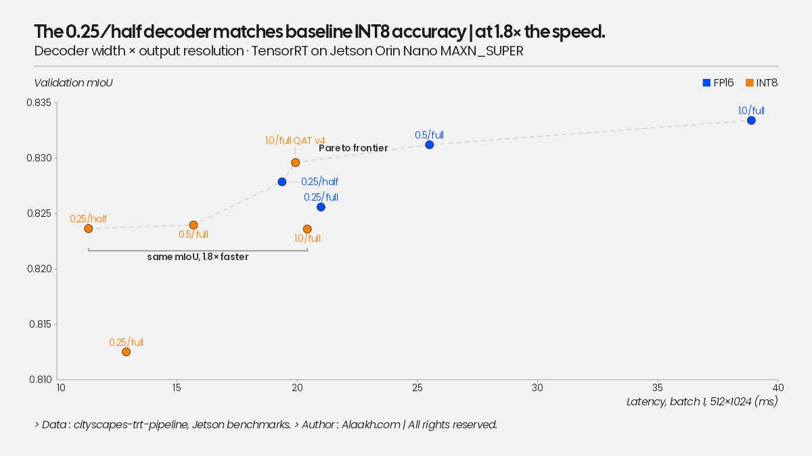

# cityscapes-trt-pipeline

[](https://github.com/Alaakmg/Cityscapes-TRT-Pipeline/actions/workflows/ci.yml)

Deployment pipeline for a Cityscapes semantic segmentation model (ResNet50 U-Net,
8 categories): PyTorch -> ONNX -> TensorRT (FP32 / FP16 / INT8-PTQ / INT8-QAT),
targeting a Jetson Orin Nano.

Follow-up to my earlier Cityscapes training projects (U-Net / U-Net3+ in Keras).
This one is about everything that happens after training: export, quantization,
benchmarking, profiling. Write-up: [docs/writeup.md](docs/writeup.md) ·
decision log: [docs/adr.md](docs/adr.md) · findings: [docs/findings.md](docs/findings.md).

## Headline numbers

Every number is measured on the deployed TensorRT engine, on the device named:

- Desktop (RTX 5090): FP16 gives 3.8x over eager PyTorch at 2.8x smaller,
  with mIoU identical to four decimals. INT8 buys ~4% more. 2.4 ms / 419 img/s.
- Jetson Orin Nano: INT8 is 1.9x faster than FP16 and takes 2.3x less energy
  per frame. Nothing in the desktop table predicts this.
- QAT beat PTQ on both axes, but it took four engine iterations, each driven
  by a `trtexec` layer profile (residual Q/DQ, BatchNorm folding, concat
  quantizers), to end fully INT8 at **19.9 ms / 50 fps / 0.8296 mIoU** vs
  PTQ's 20.4 ms / 0.8236.
- The productive architecture knob was the decoder, not the 44M-param
  backbone: a 0.25-width decoder predicting at 1/2 resolution matches the
  baseline's INT8 accuracy at 1.8x the speed.
  **11.3 ms / 88 fps / 189 mJ per frame at 17 W.**



Precision sets the energy per frame; the power mode only sets the frame rate:


## Results

Accuracy is always measured on the deployed artifact itself
(`python -m segdeploy.evaluate --backend ...`), never on the source PyTorch model.
Latency: batch 1, 512x1024, 20 warmup + 200 timed iterations, explicit device sync.

Desktop = RTX 5090 (RunPod), TensorRT 10.16.1, torch 2.8.0+cu128.
Jetson = Orin Nano Super 8 GB, JetPack 7.2.1 (L4T R39.2.1, TensorRT 10.16.2, CUDA 13.2),
power mode MAXN_SUPER with `jetson_clocks` (GPU locked 1.02 GHz, EMC 3.2 GHz).
Jetson power = module input (`VDD_IN`) sampled by `tegrastats` at 2 Hz, averaged over the
benchmark's own run time (energy above the pre-run idle baseline, divided by
220 iterations x mean latency; `segdeploy.power`). Idle samples before and after the run
are excluded; an earlier revision averaged the whole log and under-reported by 10-45%.
Raw JSONs, tegrastats logs and `trtexec` layer profiles in `results/`.

| Variant | Precision | Device | mIoU | Δ vs FP32 | Latency mean (ms) | p95 (ms) | img/s | Size (MB) |
|---|---|---|---|---|---|---|---|---|
| PyTorch | FP32 | RTX 5090 | 0.8334 | – | 9.41 | 9.54 | 106 | 176 |
| TensorRT | FP32 | RTX 5090 | 0.8334 | ±0.0000 | 6.13 | 6.30 | 163 | 251 |
| TensorRT | FP16 | RTX 5090 | 0.8334 | −0.0000 | 2.48 | 2.59 | 403 | 89 |
| TensorRT | INT8 (PTQ) | RTX 5090 | 0.8246 | −0.0088 | 2.39 | 2.50 | 419 | 46 |
| TensorRT | INT8 (QAT v1) | RTX 5090 | 0.8290 | −0.0044 | 2.54 | 2.60 | 394 | 107 |
| TensorRT | INT8 (QAT v2) | RTX 5090 | 0.8287 | −0.0047 | 2.50 | 2.51 | 400 | 107 |
| TensorRT | INT8 (QAT v3) | RTX 5090 | 0.8267 | −0.0067 | 2.47 | 2.48 | 405 | 107 |
| TensorRT | INT8 (QAT v4) | RTX 5090 | 0.8295 | −0.0039 | 3.10 | 3.11 | 323 | 46 |
| TensorRT | FP32 | Jetson Orin Nano | 0.8334 | ±0.0000 | 108.8 | 109.1 | 9.2 | 176 |
| TensorRT | FP16 | Jetson Orin Nano | 0.8334 | −0.0000 | 38.9 | 39.0 | 25.7 | 88 |
| TensorRT | INT8 (PTQ) | Jetson Orin Nano | 0.8236 | −0.0098 | **20.4** | 20.5 | **49.0** | 45 |
| TensorRT | INT8 (QAT v1) | Jetson Orin Nano | 0.8290 | −0.0044 | 31.8 | 31.8 | 31.5 | 45 |
| TensorRT | INT8 (QAT v2) | Jetson Orin Nano | 0.8287 | −0.0047 | 29.6 | 29.6 | 33.8 | 45 |
| TensorRT | INT8 (QAT v3) | Jetson Orin Nano | 0.8268 | −0.0066 | 26.4 | 26.5 | 37.9 | 45 |
| TensorRT | **INT8 (QAT v4)** | Jetson Orin Nano | **0.8296** | −0.0038 | **19.9** | 20.1 | **50.2** | 45 |

All rows: harness v2 (pinned host buffers, private CUDA stream), within ~0.5 ms of `trtexec`.
The original v1-harness numbers stay in `results/` for reference.

QAT went through four versions, each driven by a `trtexec` layer profile on the Jetson:
v1 (plain Q/DQ, 48 FP16 layers), v2 (+ residual-branch quantizers, 18), v3 (+ BatchNorm
folded before quantization, 2), v4 (+ decoder concat inputs quantized, 0). v4 is
fully INT8, faster than PTQ and +0.6 mIoU over it on the Jetson: 19.9 ms, 50 fps,
365 mJ/frame, 0.8296. The story is in [`docs/findings.md`](docs/findings.md).

FP16 on the desktop: 3.8x faster than eager PyTorch, 2.8x smaller, zero measurable mIoU loss
(per-class IoU stable to 4 decimals, including the thin-structure classes). ONNX export
parity: max abs logit diff 4.1e-05, argmax mismatch 3.8e-06 (`results/.../parity_onnx.json`).

Jetson: INT8 is 1.9x faster than FP16 and 2.3x more energy-efficient
(QAT v4: 365 vs 848 mJ/frame) for −0.4 mIoU point. The desktop table alone
argues the other way; the Jetson is the device that ships. Details and the
profiling breakdown in [`docs/findings.md`](docs/findings.md).

Power-mode sweep (all engines, 15 W / 25 W / MAXN_SUPER, clocks locked and DVFS):
energy per frame is set by the precision, the power mode only moves latency.
INT8-PTQ is the only configuration above 30 fps at 25 W.

| Jetson, clocks locked | 15 W | 25 W | MAXN_SUPER |
|---|---|---|---|
| FP16 ms / fps / W / mJ per frame | 64.9 / 15.4 / 11.9 / 774 | 44.2 / 22.6 / 18.3 / 811 | 41.5 / 24.1 / 20.1 / 835 |
| INT8-PTQ ms / fps / W / mJ per frame | 36.0 / 27.8 / 10.7 / 384 | 25.0 / 40.0 / 15.2 / 380 | 22.9 / 43.6 / 17.0 / 389 |
| INT8 vs FP16 | 1.80x faster, 2.0x less energy | 1.77x, 2.1x | 1.81x, 2.1x |

Decoder-width experiment (hardware-aware architecture search, untrained latency
probes first, then 60-epoch training for the 3 candidates): a 0.25-width decoder
predicting at 1/2 resolution matches the baseline's INT8 accuracy at 1.8x the
speed, at 11.3 ms / 88 fps / 189 mJ per frame on the Jetson. Full Pareto in
[`docs/findings.md`](docs/findings.md).

INT8-PTQ observations (desktop): −0.9 mIoU points for a 2x smaller engine, but only a
4% latency win over FP16 at batch 1 on the 5090. The workload isn't INT8-math-bound
there; the INT8 case rests on the bandwidth-starved Jetson. Degradation is spread
across classes (construction/object/nature −1.4 to −1.6 pts), the QAT row exists
to win that back.

Per-class IoU breakdowns will go in `docs/findings.md`. Thin structures (poles,
humans) are usually the first classes to suffer under quantization, so I track
per-class IoU everywhere, not just the mean.

## Pipeline

```
train.py ──> best.pt ──> export_onnx.py ──> model.onnx ──> build_engine.py ──> .engine
                │              │                                  │
                │              └── check_parity.py (CI gate)      ├── FP16
                │                                                 ├── INT8 PTQ (entropy calib.)
                └── qat_finetune.py ──> Q/DQ ONNX ────────────────└── INT8 QAT
```

`segdeploy/runners.py` gives torch / ONNX Runtime / TensorRT the same interface,
so evaluation and benchmarking run the exact same code for every backend.

## Quickstart

```bash
pip install -e ".[dev]"
pytest -q

# FP32 baseline (needs Cityscapes at data_root, see configs/baseline.yaml)
python -m segdeploy.train --config configs/baseline.yaml

# export + parity gate
python export/export_onnx.py --checkpoint runs/fp32/best.pt --out model.onnx
python export/check_parity.py --checkpoint runs/fp32/best.pt --onnx model.onnx

# engines (run ON the target device, engines are not portable)
python trt/build_engine.py --onnx model.onnx --out model_fp16.engine --fp16
python trt/build_engine.py --onnx model.onnx --out model_int8.engine --int8 \
    --calib-dir $CITYSCAPES/leftImg8bit/train --calib-images 500

# INT8 QAT: fine-tune with fake quant (modelopt), export Q/DQ onnx,
# then build --int8 with no calibrator (ranges live in the graph)
python trt/qat_finetune.py --config configs/baseline.yaml --checkpoint runs/fp32/best.pt --out runs/qat
python trt/build_engine.py --onnx runs/qat/model_qat.onnx --out model_int8_qat.engine --int8

# accuracy + latency of any artifact
python -m segdeploy.evaluate  --backend trt --model model_int8.engine --data-root $CITYSCAPES
python -m segdeploy.benchmark --backend trt --model model_int8.engine
```

## Outputs

Every stage writes its numbers to disk, nothing lives only in stdout:

| Stage | Writes | Used for |
|---|---|---|
| `train.py` / `qat_finetune.py` | `<out_dir>/metrics.jsonl` (per-step loss/LR, per-epoch val mIoU + per-class IoU) | loss/mIoU curves, baseline vs QAT overlays |
| `evaluate.py --out r.json` | mIoU, pixel acc, per-class IoU, full confusion matrix | confusion heatmaps, per-class degradation bars |
| `benchmark.py --out b.json` | summary stats + raw per-iteration latencies | latency histograms, p99 / tail analysis |
| `check_parity.py --out p.json` | max abs/rel diff, argmax mismatch, pass flag | export fidelity across opsets/versions |
| `build_engine.py` | `<engine>.meta.json` (precision, size, build time, TRT version) | size vs precision, engine provenance |
| `power.py` | reads `tegrastats.log` + `b.json` -> W and mJ per frame over the run | Jetson energy tables, power-mode sweep (`--rebuild-sweep`) |

One directory per variant (`results/trt_fp16/`, `results/trt_int8_qat/`, ...).
Engines are disposable, their `.meta.json` sidecars are not.

Training curves come from:

```bash
python scripts/plot_training.py --run runs/fp32 --out docs/curves_fp32.png
# overlay runs, e.g. baseline vs QAT:
python scripts/plot_training.py --run runs/fp32 --run runs/qat --out docs/curves_qat.png
```

## Design notes

The full decision log, with context and consequences for each choice, is in
[`docs/adr.md`](docs/adr.md). Short version:

- **Static input shape (1x3x512x1024).** Cameras run at a fixed resolution anyway,
  and static shapes keep TensorRT profiles and INT8 calibration simple. The cost is
  one engine per resolution, which I can live with.
- **Plain Conv/BN/ReLU + nearest upsampling, single output head.** No deformable
  convs, no custom ops. I'd rather spend time on quantization than on opset fights.
- **One preprocessing function** (`segdeploy.data.preprocess_image`) shared by
  training, parity checks and the INT8 calibrator. Calibration data that doesn't
  match inference preprocessing silently ruins INT8 accuracy.
- **Engines are built on the device that runs them.** TensorRT engines are tied to
  GPU architecture + TRT version. The repo ships ONNX, never engines.

## Roadmap

- [x] skeleton, CI, benchmark methodology fixed before any experiment
- [x] FP32 baseline trained on Cityscapes (8 categories): val mIoU 0.833, 60 epochs
- [x] ONNX export + numerical parity gate
- [x] TensorRT FP32/FP16, accuracy measured on the engine itself
- [x] INT8: PTQ (entropy calibration), then QAT (modelopt, Q/DQ export)
- [x] Jetson Orin Nano: on-device benchmarks, power, `trtexec` layer profiling

## Dataset

Cityscapes requires registration (research/non-commercial terms):
https://www.cityscapes-dataset.com. This repo contains no dataset content, point
`data_root` at your local copy.
