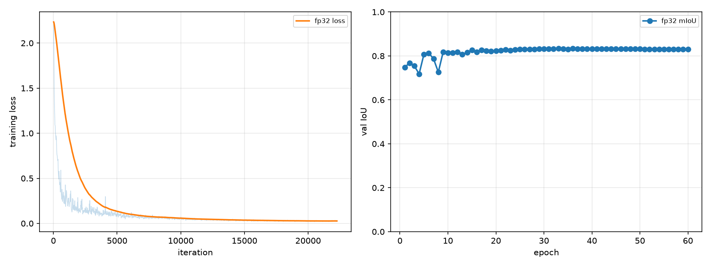
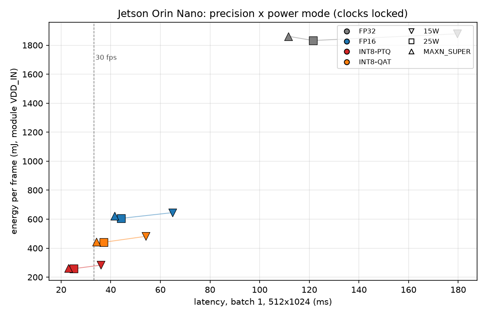

# Findings

Working notes as the pipeline progresses. Numbers come from the JSONs in
`results/`; nothing here is quoted from memory.

## FP32 baseline (RTX 5090, 60 epochs, ~65 min, ~$1)

Best val mIoU **0.8334** at epoch 35; the last 25 epochs only flatten the curve
(final epoch 0.8310). My old TF/Keras U-Net on the same 8-category task topped
out at 0.786 with 60.5M params. This one does +4.7 points with 44M, mostly
thanks to the ImageNet-pretrained ResNet50 encoder (epoch 1 already hits 0.748)
and a properly scheduled AdamW + cosine run.

Per-class IoU makes the difficulty ranking obvious, and it never changes across
backends or precisions:

| | flat | sky | vehicle | nature | construction | human | void | object |
|---|---|---|---|---|---|---|---|---|
| FP32 | 0.937 | 0.927 | 0.912 | 0.908 | 0.881 | 0.774 | 0.713 | 0.616 |

`object` (poles, traffic signs, other thin structures) and `human` are the weak
classes. They are the ones to watch under quantization.

## ONNX export is exact (for practical purposes)

Max abs logit diff vs PyTorch: **4.1e-05**; argmax flips: **3.8e-06** of pixels
(~8 per million). One trap for the unwary: max *relative* diff looks alarming
(~2.3) but it lives entirely on near-zero logits where relative error is
meaningless. Gate on absolute diff + argmax agreement, not relative.

## FP16 is a free lunch here

| backend | mIoU | mean ms | p95 ms | img/s | MB |
|---|---|---|---|---|---|
| PyTorch FP32 | 0.8334 | 9.35 | 9.66 | 107 | 176 |
| TRT FP32 | 0.8334 | 6.17 | 6.19 | 162 | 251 |
| TRT FP16 | 0.8334 | 2.96 | 2.97 | 338 | 89 |
| TRT INT8-PTQ | 0.8246 | 2.94 | 2.96 | 340 | 46 |

FP16: 3.2x over eager PyTorch, 2.8x smaller, and mIoU identical to four
decimals, `object` and `human` included. Also worth noticing: TensorRT's
latency distribution is *tight* (FP32: 6.17 mean / 6.19 p95) where PyTorch
eager has visible spread. Determinism is its own feature on an AV stack.

## INT8 does NOT beat FP16 on a desktop GPU at batch 1

The surprise of the table: INT8-PTQ is 2.94 ms vs FP16's 2.96 ms. Nothing.
At batch 1 on a 5090 (1.8 TB/s of bandwidth) this network is not INT8-math
bound; halving the weights (46 MB engine) doesn't move the needle when
activations dominate traffic and the tensor cores were already underfed at
FP16. The INT8 story has to be earned on the bandwidth-starved target (Jetson
Orin Nano, ~68 GB/s); that measurement is next.

Meanwhile INT8-PTQ costs **−0.9 mIoU points**, spread across classes
(construction/object/nature each lose 1.4–1.6 pts) rather than concentrated in
the thin classes as I expected. QAT's job is to claw that back; if it recovers
most of the 0.9 while keeping the 46 MB engine, INT8 becomes strictly better
than FP16 *on the Jetson* or it doesn't ship.

## QAT: the default calibration nearly ended the experiment

modelopt's `INT8_DEFAULT_CFG` collapsed the model from 0.833 to **0.18 mIoU**
before training even started. The trail, because the diagnosis is the finding:

1. First QAT run "recovered" 0.54 -> 0.70 over 5 epochs. That trajectory is a
   model re-learning from damaged weights, not fine-tuning: something broke at
   the quantize step.
2. Controlled experiment: checkpoint alone 0.8334; after `mtq.quantize` with
   defaults, 0.1822. Quantize step guilty.
3. The quantizer summary named the culprit: input activations on `layer2`
   convs with **amax ~1.28e3** under per-tensor MaxCalibrator. Those are the
   well-known torchvision-ResNet BN outlier channels; with int8 scales set by
   a ~1300 outlier, ordinary O(1-10) activations collapse into one or two
   quantization bins. More calibration data can't help; max only grows.
4. Fix: histogram calibration with percentile clipping (99.9) for
   activations, max for weights. Restores **0.8186** with zero training.
   This is the same idea as TensorRT's entropy calibrator (which is why PTQ
   never had this problem): rare outliers get saturated, the scale serves the
   distribution instead of the extremes.
5. QAT fine-tune from there: best 0.8289 at epoch 1 of 5 (later epochs drift
   slightly; at lr 1e-5 there's nothing left to learn). The built engine
   measures **0.8290**. The fake-quant model predicted its deployed accuracy
   to under a tenth of a point, which is the promise of QAT.

modelopt sharp edges hit on the way (v0.46): `quant_cfg` patterns are
`*input_quantizer` (no trailing star) with settings nested under `cfg`, so a
wrong pattern silently no-ops, so assert your config applied; the stock max
calibration driver crashes on histogram calibrators (`compute_amax()` without
a method), so histogram calibration has to be driven manually via
`enable_stats_collection` + per-quantizer `load_calib_amax`; and
`modelopt.torch.opt` imports `huggingface_hub` unconditionally without
declaring it.

Scoreboard after QAT: **PTQ -0.88 pts, QAT -0.44 pts** vs FP32. But the QAT
engine is bigger (107 vs 46 MB) and marginally slower (3.17 vs 2.94 ms) than
implicit PTQ on desktop: explicit Q/DQ leaves more of the graph in high
precision than TRT's implicit quantization chooses to. On the 5090, INT8-QAT
buys accuracy, not speed. Whether any INT8 variant is worth shipping is
decided on the Jetson.

## Jetson Orin Nano: where INT8 pays off

JetPack 7.2.1, TensorRT 10.16.2, MAXN_SUPER with locked clocks (GPU 1.02 GHz,
EMC 3.2 GHz). Same ONNX files as the desktop, engines built on the device.
Power is module input (`VDD_IN`) from `tegrastats` at 2 Hz during the benchmark.

| engine | mIoU | mean ms | p95 ms | img/s | MB | power | mJ/frame |
|---|---|---|---|---|---|---|---|
| FP32 | 0.8334 | 111.7 | 112.5 | 9.0 | 176 | 16.6 W | 1848 |
| FP16 | 0.8334 | 41.6 | 42.4 | 24.1 | 88 | 15.2 W | 632 |
| INT8-PTQ | 0.8236 | **22.9** | 23.6 | **43.6** | 45 | **11.7 W** | **268** |
| INT8-QAT | 0.8290 | 34.3 | 35.0 | 29.1 | 45 | 13.0 W | 445 |

On the desktop, INT8 bought nothing (2.94 vs 2.96 ms). Here, INT8-PTQ is
1.8x faster than FP16 and 2.4x cheaper per frame in energy, for one mIoU
point. On a 68 GB/s device, halving the bytes moved per layer shows up
directly in the frame time; on a 1.8 TB/s desktop card it never did.
Accuracy on-device matches the desktop to the 4th decimal for FP16 and QAT; PTQ
lands at 0.8236 vs 0.8246 from the same calibration cache (TensorRT picked
different kernels, the scales are identical).

GPU temperature peaked at 66 C under sustained locked-clock load, 33 C below the
throttle point. No thermal effect on any number.

### Power-mode sweep: precision sets the energy, the mode sets the frame rate

All four engines at 15 W (GPU 612 MHz / EMC 2133), 25 W (918 / 3199) and
MAXN_SUPER (1020 / 3199), each with clocks locked and with the stock DVFS
governor. 24 runs, full table in `results/jetson_orin_nano/sweep/summary.json`.

| locked clocks | 15 W | 25 W | MAXN_SUPER |
|---|---|---|---|
| FP32 | 179.7 ms, 1878 mJ | 121.5 ms, 1832 mJ | 111.5 ms, 1862 mJ |
| FP16 | 64.9 ms, 645 mJ | 44.2 ms, 606 mJ | 41.5 ms, 621 mJ |
| INT8-PTQ | 36.0 ms, 283 mJ | 25.0 ms, 258 mJ | 22.9 ms, 261 mJ |
| INT8-QAT | 54.2 ms, 482 mJ | 37.1 ms, 441 mJ | 34.3 ms, 443 mJ |

Three things I did not expect to be this clean:

1. **Energy per frame barely moves with power mode.** INT8-PTQ costs ~260-280 mJ
   per frame at every mode; FP16 ~600-650. The modes trade latency for power
   almost linearly, so the energy bill is a property of the precision. If the
   budget is joules (battery), pick the precision; if it is milliseconds, pick
   the mode.
2. **The INT8 advantage is constant.** 1.77-1.81x faster and 2.3-2.4x less
   energy than FP16 at all three modes. Not a Super-mode artifact.
3. **Super mode buys latency, not efficiency.** Vs 25 W it is 6-8% faster
   (GPU clock +11%, memory clock unchanged; the workload is partly
   memory-bound, so it doesn't scale with GPU clock) at ~10% more power, same
   mJ/frame.

Decision table for a 30 fps target: INT8-PTQ at 25 W (40 fps, 10.3 W) is the
answer; FP16 never gets there, even at MAXN_SUPER (24 fps). INT8-QAT at
MAXN_SUPER just misses (29 fps); the residual-quantization fix below is
aimed at that.

DVFS vs locked clocks: means within 1-4%, p95 a little wider under DVFS (INT8 at
MAXN_SUPER: 25.4 vs 23.6 ms). A 20-iteration warm-up is enough for the governor
to ramp; locking clocks mostly buys tail determinism, and that is what I report.

### What the profiler says (`trtexec --dumpProfile`)

Transfers are not the problem. H2D 0.35-0.48 ms, D2H 0.83-0.94 ms per frame
(the 16.8 MB FP32 logits tensor). My Python harness adds ~2.8 ms on top of
trtexec's with-transfer latency (pageable numpy copies + sync); that's 12% at
INT8 and worth fixing (pinned buffers, argmax on device to shrink the output
32x) but it's not the bottleneck.

**The decoder is.** FP16, per stage:

| stage | ms | share |
|---|---|---|
| decoder (5 blocks) | 25.0 | 66% |
| ResNet50 encoder | 12.1 | 32% |
| head | 0.7 | 2% |

The encoder holds nearly all the parameters and a third of the time. The
decoder's first 3x3 conv in every block sits at the top of the profile
(`dec4/conv1` alone: 5.1 ms, 13.6%, a 3x3 over 3072 concatenated channels;
`dec0`/`dec1` run at full/half resolution on 512x1024). Those layers are
memory-bound, which is also why INT8 helps them most. The architecture change
to make, if I wanted a faster model rather than a faster engine, is a thinner decoder:
fewer channels in dec0/dec1 and a narrower dec4 input, not a smaller backbone.

### Why the QAT engine is slower than PTQ (and how to fix it)

Same 45 MB, identical per-conv times where they line up (dec4/conv1: 1.79 ms in
both). And yet 30.1 vs 18.8 ms of GPU time. The difference is all in the
encoder: **13.8 ms over 100 layers (QAT) vs 6.5 ms over 58 layers (PTQ)**. The
explicit-quantization graph from modelopt puts Q/DQ on conv inputs and weights
but not on the residual-add inputs of the ResNet bottlenecks, so TensorRT cannot
fuse conv + add + ReLU into one INT8 kernel: the add runs in higher precision
as a separate layer, with re-quantization around it. NVIDIA's TensorRT docs
call this out explicitly (quantize the residual branch), and the layer count
is the fingerprint. Fix for the next QAT run: add quantizers on the residual
path (and the decoder concat inputs), then the QAT engine should land near
PTQ's 23 ms with its 0.829 mIoU, the best of both columns.

### Platform notes

- JetPack 7's ISO installer only updated the QSPI firmware on a *blank* microSD;
  with an OS already present it skipped/stalled the capsule step, leaving a
  39.x kernel on 36.x firmware (text console fine, GPU driver dead, no setup
  wizard). Wipe the card, reinstall, watch both capsule passes complete.
- The standard `torch` cu130 aarch64 wheel runs on Orin (sm_87) through PTX
  JIT with a warning that 8.7 is not among the compiled targets. Fine here -
  torch is only the CUDA allocator for the TensorRT runner, but for torch
  compute on the device use NVIDIA's Jetson builds.
- A DisplayPort-to-USB-C cable into a USB-C portable monitor does not work for
  UEFI/installer output (no USB-C source handshake). Native DP or HDMI, or a
  serial console on the 12-pin header.

## Toolchain notes (the parts nobody's blog post mentions)

- **TensorRT 11 removed `IInt8EntropyCalibrator2`.** Implicit INT8
  quantization is gone there; explicit Q/DQ is the only INT8 path. I pinned
  desktop TRT to 10.x to match what JetPack ships on the Orin, which also
  keeps the entropy-calibration PTQ row reproducible. Practical consequence:
  calibrator-style PTQ is legacy API on borrowed time; the QAT/Q-DQ pipeline
  is the one with a future.
- **pycuda is a liability as a dependency.** No wheels, needs nvcc + boost
  headers at install time, and the RunPod PyTorch image ships neither. Torch
  is a hard dependency of this project anyway, so the TRT runner and the
  calibrator now use torch CUDA tensors as device buffers (`data_ptr()` +
  current stream). One less install step on every target, Jetson included.
- **`IHostMemory` lost `len()` somewhere before TRT 10.16.** Use
  `memoryview(x).nbytes`. Small, but it broke the engine-metadata sidecar.
- Engine builds look slow (~minutes) only on the first build per machine;
  TensorRT's kernel-timing cache makes every subsequent build take seconds.
  Consequence: rebuilding all engines from ONNX on a fresh pod costs almost
  nothing, so engines really can be treated as disposable.

## Next

- QAT v2: quantize the residual-add and concat inputs so TensorRT can fuse the
  bottlenecks; target ~23 ms at 0.829 mIoU on the Jetson.
- Harness: pinned host buffers + on-device argmax (uint8 mask out instead of
  FP32 logits), ~2-3 ms off the Jetson numbers.
- Thinner decoder as the architecture experiment the profile points at.
