# Findings

Working notes as the pipeline progresses. Numbers come from the JSONs in
`results/`; nothing here is quoted from memory.

## FP32 baseline (RTX 5090, 60 epochs, ~65 min, ~$1)

Best val mIoU **0.8334** at epoch 35; the last 25 epochs only flatten the curve
(final epoch 0.8310). My old TF/Keras U-Net on the same 8-category task topped
out at 0.786 with 60.5M params. This one does +4.7 points with 44M, mostly
thanks to the ImageNet-pretrained ResNet50 encoder (epoch 1 already hits 0.748)
and a properly scheduled AdamW + cosine run.

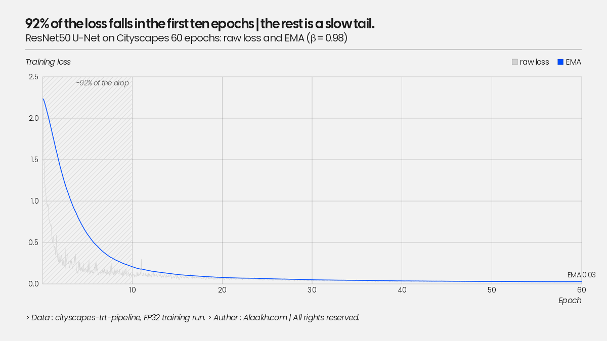

Per-class IoU makes the difficulty ranking obvious, and it never changes across
backends or precisions:

| | flat | sky | vehicle | nature | construction | human | void | object |
|---|---|---|---|---|---|---|---|---|
| FP32 | 0.937 | 0.927 | 0.912 | 0.908 | 0.881 | 0.774 | 0.713 | 0.616 |

`object` (poles, traffic signs, other thin structures) and `human` are the weak
classes. They are the ones to watch under quantization.

## ONNX export is exact (for practical purposes)

Max abs logit diff vs PyTorch: **4.1e-05**; argmax flips: **3.8e-06** of pixels
(~8 per million). One trap for the unwary: max *relative* diff looks alarming
(~2.3) but it lives entirely on near-zero logits where relative error is
meaningless. Gate on absolute diff + argmax agreement, not relative.

## FP16 is a free lunch here

| backend | mIoU | mean ms | p95 ms | img/s | MB |
|---|---|---|---|---|---|
| PyTorch FP32 | 0.8334 | 9.35 | 9.66 | 107 | 176 |
| TRT FP32 | 0.8334 | 6.17 | 6.19 | 162 | 195 |
| TRT FP16 | 0.8334 | 2.96 | 2.97 | 338 | 89 |
| TRT INT8-PTQ | 0.8246 | 2.94 | 2.96 | 340 | 46 |

FP16: 3.2x over eager PyTorch, 2.2x smaller than the FP32 engine, and mIoU identical to four
decimals, `object` and `human` included. Also worth noticing: TensorRT's
latency distribution is *tight* (FP32: 6.17 mean / 6.19 p95) where PyTorch
eager has visible spread. Determinism is its own feature on an AV stack.

## INT8 does NOT beat FP16 on a desktop GPU at batch 1

The surprise of the table: INT8-PTQ is 2.94 ms vs FP16's 2.96 ms. Nothing.
At batch 1 on a 5090 (1.8 TB/s of bandwidth) this network is not INT8-math
bound; halving the weights (46 MB engine) doesn't move the needle when
activations dominate traffic and the tensor cores were already underfed at
FP16. The INT8 story has to be earned on the bandwidth-starved target (Jetson
Orin Nano, ~68 GB/s); that measurement is next.

Meanwhile INT8-PTQ costs **−0.9 mIoU points**, spread across classes
(construction/object/nature each lose 1.4–1.6 pts) rather than concentrated in
the thin classes as I expected. QAT's job is to claw that back; if it recovers
most of the 0.9 while keeping the 46 MB engine, INT8 becomes strictly better
than FP16 *on the Jetson* or it doesn't ship.

## QAT: the default calibration nearly ended the experiment

modelopt's `INT8_DEFAULT_CFG` collapsed the model from 0.833 to **0.18 mIoU**
before training even started. The trail, because the diagnosis is the finding:

1. First QAT run "recovered" 0.54 -> 0.70 over 5 epochs. That trajectory is a
   model re-learning from damaged weights, not fine-tuning: something broke at
   the quantize step.
2. Controlled experiment: checkpoint alone 0.8334; after `mtq.quantize` with
   defaults, 0.1822. Quantize step guilty.
3. The quantizer summary named the culprit: input activations on `layer2`
   convs with **amax ~1.28e3** under per-tensor MaxCalibrator. Those are the
   well-known torchvision-ResNet BN outlier channels; with int8 scales set by
   a ~1300 outlier, ordinary O(1-10) activations collapse into one or two
   quantization bins. More calibration data can't help; max only grows.
4. Fix: histogram calibration with percentile clipping (99.9) for
   activations, max for weights. Restores **0.8186** with zero training.
   This is the same idea as TensorRT's entropy calibrator (which is why PTQ
   never had this problem): rare outliers get saturated, the scale serves the
   distribution instead of the extremes.
5. QAT fine-tune from there: best 0.8289 at epoch 1 of 5 (later epochs drift
   slightly; at lr 1e-5 there's nothing left to learn). The built engine
   measures **0.8290**. The fake-quant model predicted its deployed accuracy
   to under a tenth of a point, which is the promise of QAT.

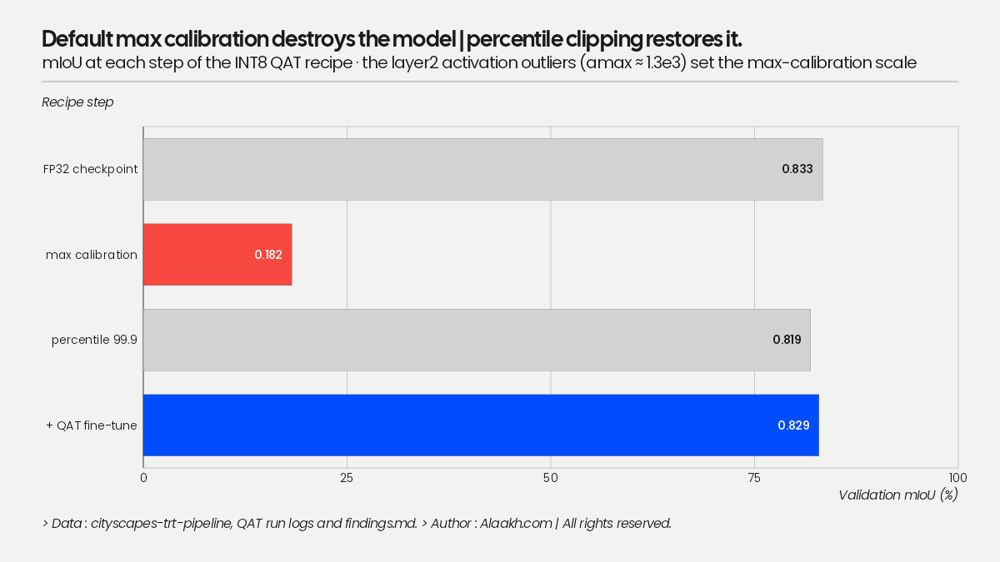

modelopt sharp edges hit on the way (v0.46): `quant_cfg` patterns are
`*input_quantizer` (no trailing star) with settings nested under `cfg`, so a
wrong pattern silently no-ops, so assert your config applied; the stock max
calibration driver crashes on histogram calibrators (`compute_amax()` without
a method), so histogram calibration has to be driven manually via
`enable_stats_collection` + per-quantizer `load_calib_amax`; and
`modelopt.torch.opt` imports `huggingface_hub` unconditionally without
declaring it.

Scoreboard after QAT: **PTQ -0.88 pts, QAT -0.44 pts** vs FP32. But the QAT
engine is bigger (107 vs 46 MB) and marginally slower (3.17 vs 2.94 ms) than
implicit PTQ on desktop: explicit Q/DQ leaves more of the graph in high
precision than TRT's implicit quantization chooses to. On the 5090, INT8-QAT
buys accuracy, not speed. Whether any INT8 variant is worth shipping is
decided on the Jetson.

## Jetson Orin Nano: where INT8 pays off

JetPack 7.2.1, TensorRT 10.16.2, MAXN_SUPER with locked clocks (GPU 1.02 GHz,
EMC 3.2 GHz). Same ONNX files as the desktop, engines built on the device.
Power is module input (`VDD_IN`) from `tegrastats` at 2 Hz, averaged over the
benchmark's run time (see the correction note below).

| engine | mIoU | mean ms | p95 ms | img/s | MB | power | mJ/frame |
|---|---|---|---|---|---|---|---|
| FP32 | 0.8334 | 111.7 | 112.5 | 9.0 | 176 | 19.0 W | 2124 |
| FP16 | 0.8334 | 41.6 | 42.4 | 24.1 | 88 | 20.4 W | 848 |
| INT8-PTQ | 0.8236 | **22.9** | 23.6 | **43.6** | 45 | **16.4 W** | **377** |
| INT8-QAT | 0.8290 | 34.3 | 35.0 | 29.1 | 45 | 17.4 W | 597 |

On the desktop, INT8 bought nothing (2.94 vs 2.96 ms). Here, INT8-PTQ is
1.8x faster than FP16 and 2.2x cheaper per frame in energy, for one mIoU
point. On a 68 GB/s device, halving the bytes moved per layer shows up
directly in the frame time; on a 1.8 TB/s desktop card it never did.
Accuracy on-device matches the desktop to the 4th decimal for FP16 and QAT; PTQ
lands at 0.8236 vs 0.8246 from the same calibration cache (TensorRT picked
different kernels, the scales are identical).

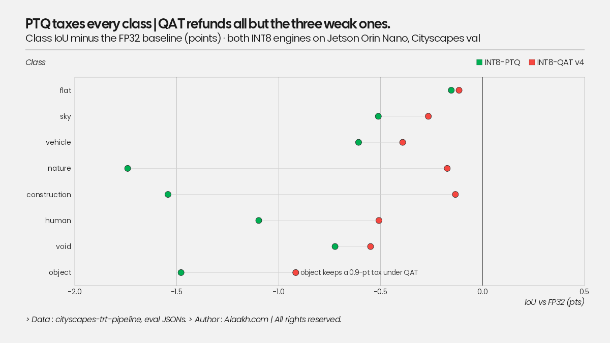

GPU temperature peaked at 66 C under sustained locked-clock load, 33 C below the
throttle point. No thermal effect on any number.

**Power method, corrected 2026-09-02.** The first pass averaged `VDD_IN` over
every sample in the log. The logs start and end at idle (~6 W), so that mean
mixed idle into the number, and the shorter the run the worse it got: a 5 s
INT8 run in a 10 s log was half idle. The bias favoured the fast engines,
which is the wrong direction to be wrong in. `segdeploy.power` now integrates
the energy above the pre-run idle baseline over the whole log and divides it
by the run's known duration (220 iterations x mean latency), which is also
insensitive to the sensor's ramp at the start and decay at the end of a run.
Every W and mJ figure in this file, the README, the write-up and the ADRs was
regenerated from the raw logs; `sweep/summary.json` keeps the old whole-log
mean as `W_logmean` / `mJ_logmean`. Latencies and mIoU are untouched. What
changed: absolute energy rose 10-45% (most for INT8 and the narrow decoders),
the INT8-vs-FP16 energy ratio fell from 2.4x to 2.1-2.2x, and the "energy per
frame is set by precision, not mode" finding got cleaner, not weaker.

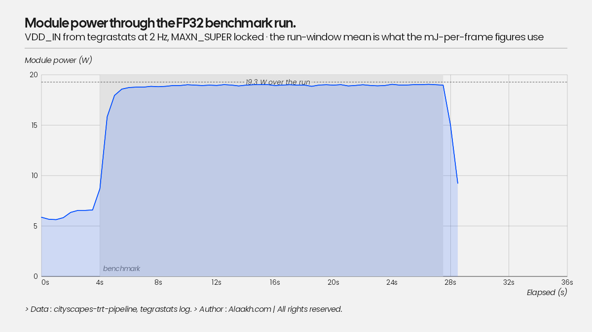

### Power-mode sweep: precision sets the energy, the mode sets the frame rate

All four engines at 15 W (GPU 612 MHz / EMC 2133), 25 W (918 / 3199) and
MAXN_SUPER (1020 / 3199), each with clocks locked and with the stock DVFS
governor. 24 runs, full table in `results/jetson_orin_nano/sweep/summary.json`.

| locked clocks | 15 W | 25 W | MAXN_SUPER |
|---|---|---|---|
| FP32 | 179.7 ms, 2040 mJ | 121.5 ms, 2076 mJ | 111.5 ms, 2149 mJ |
| FP16 | 64.9 ms, 774 mJ | 44.2 ms, 811 mJ | 41.5 ms, 835 mJ |
| INT8-PTQ | 36.0 ms, 384 mJ | 25.0 ms, 380 mJ | 22.9 ms, 389 mJ |
| INT8-QAT | 54.2 ms, 593 mJ | 37.1 ms, 586 mJ | 34.3 ms, 595 mJ |

Three things I did not expect to be this clean:

1. **Energy per frame barely moves with power mode.** INT8-PTQ costs 380-390 mJ
   per frame at every mode; FP16 770-840. The modes trade latency for power
   almost linearly, so the energy bill is a property of the precision. If the
   budget is joules (battery), pick the precision; if it is milliseconds, pick
   the mode.
2. **The INT8 advantage is constant.** 1.77-1.81x faster and 2.0-2.1x less
   energy than FP16 at all three modes. Not a Super-mode artifact.
3. **Super mode buys latency, not efficiency.** Vs 25 W it is 6-8% faster
   (GPU clock +11%, memory clock unchanged; the workload is partly
   memory-bound, so it doesn't scale with GPU clock) at 10-12% more power, 2-3%
   more mJ/frame.

Decision table for a 30 fps target: INT8-PTQ at 25 W (40 fps, 15.2 W) is the
answer; FP16 never gets there, even at MAXN_SUPER (24 fps). INT8-QAT at
MAXN_SUPER just misses (29 fps); the residual-quantization fix below is
aimed at that.

DVFS vs locked clocks: means within 1-4%, p95 a little wider under DVFS (INT8 at
MAXN_SUPER: 25.4 vs 23.6 ms). A 20-iteration warm-up is enough for the governor
to ramp; locking clocks mostly buys tail determinism, and that is what I report.

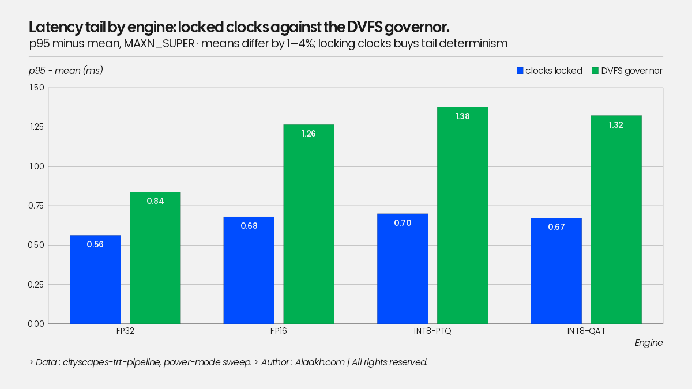

### What the profiler says (`trtexec --dumpProfile`)

Transfers are not the problem. H2D 0.35-0.48 ms, D2H 0.83-0.94 ms per frame
(the 16.8 MB FP32 logits tensor). My Python harness adds ~2.8 ms on top of
trtexec's with-transfer latency (pageable numpy copies + sync); that's 12% at
INT8 and worth fixing (pinned buffers, argmax on device to shrink the output
32x) but it's not the bottleneck.

**The decoder is.** FP16, per stage:

| stage | ms | share |
|---|---|---|
| decoder (5 blocks) | 25.0 | 66% |
| ResNet50 encoder | 12.1 | 32% |
| head | 0.7 | 2% |

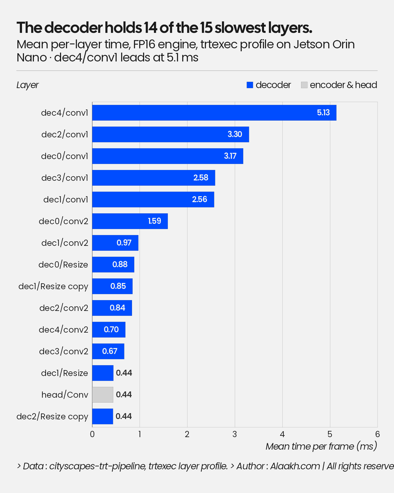

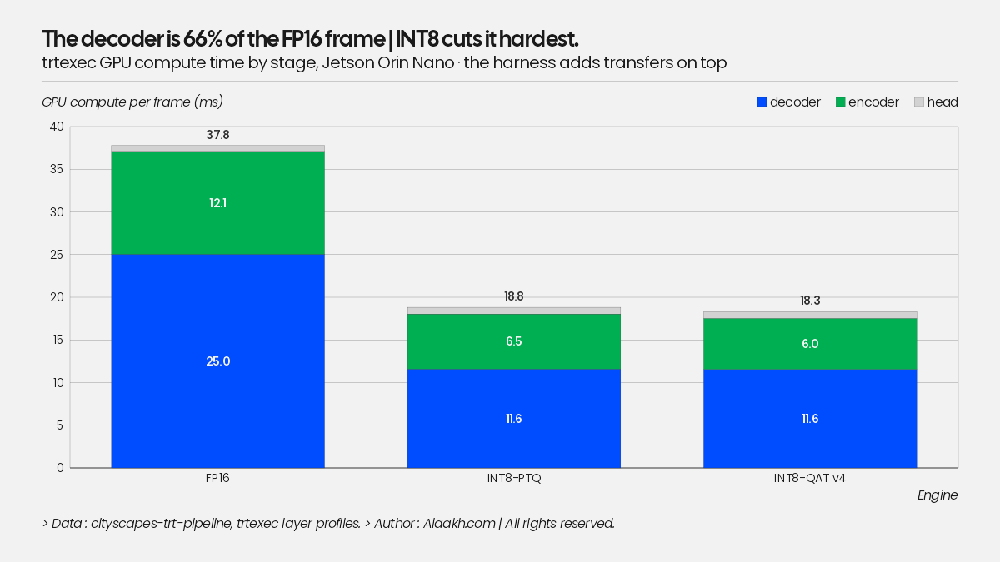

The encoder holds nearly all the parameters and a third of the time. The
decoder's first 3x3 conv in every block sits at the top of the profile
(`dec4/conv1` alone: 5.1 ms, 13.6%, a 3x3 over 3072 concatenated channels;
`dec0`/`dec1` run at full/half resolution on 512x1024). Those layers are
memory-bound, which is also why INT8 helps them most. The architecture change
to make, if I wanted a faster model rather than a faster engine, is a thinner decoder:
fewer channels in dec0/dec1 and a narrower dec4 input, not a smaller backbone.

### Why the QAT engine is slower than PTQ (and how to fix it)

Same 45 MB, identical per-conv times where they line up (dec4/conv1: 1.79 ms in
both). And yet 30.1 vs 18.8 ms of GPU time. The difference is all in the
encoder: **13.8 ms over 100 layers (QAT) vs 6.5 ms over 58 layers (PTQ)**. The
explicit-quantization graph from modelopt puts Q/DQ on conv inputs and weights
but not on the residual-add inputs of the ResNet bottlenecks, so TensorRT cannot
fuse conv + add + ReLU into one INT8 kernel: the add runs in higher precision
as a separate layer, with re-quantization around it. NVIDIA's TensorRT docs
call this out explicitly (quantize the residual branch), and the layer count
is the fingerprint. Fix for the next QAT run: add quantizers on the residual
path (and the decoder concat inputs), then the QAT engine should land near
PTQ's 23 ms with its 0.829 mIoU, the best of both columns.

### Platform notes

- JetPack 7's ISO installer only updated the QSPI firmware on a *blank* microSD;
  with an OS already present it skipped/stalled the capsule step, leaving a
  39.x kernel on 36.x firmware (text console fine, GPU driver dead, no setup
  wizard). Wipe the card, reinstall, watch both capsule passes complete.
- The standard `torch` cu130 aarch64 wheel runs on Orin (sm_87) through PTX
  JIT with a warning that 8.7 is not among the compiled targets. Fine here -
  torch is only the CUDA allocator for the TensorRT runner, but for torch
  compute on the device use NVIDIA's Jetson builds.
- A DisplayPort-to-USB-C cable into a USB-C portable monitor does not work for
  UEFI/installer output (no USB-C source handshake). Native DP or HDMI, or a
  serial console on the 12-pin header.

## Harness optimization: pinned buffers pay, on-device argmax doesn't (here)

The Jetson profile said my Python harness added ~2.8 ms per frame over
`trtexec`, and that the 16.8 MB FP32 logits tensor came back every frame. Two
fixes, measured separately on the same engines at the same locked clocks:

| Jetson, MAXN_SUPER | v1 harness | + pinned host buffers | + argmax head | trtexec w/ transfers |
|---|---|---|---|---|
| FP32 | 111.5 | 108.8 | - | - |
| FP16 | 41.5 | **38.9** | 38.7 | 38.0 |
| INT8-PTQ | 22.9 | **20.4** | 20.5 | 19.8 |
| INT8-QAT | 34.3 | **31.8** | - | - |

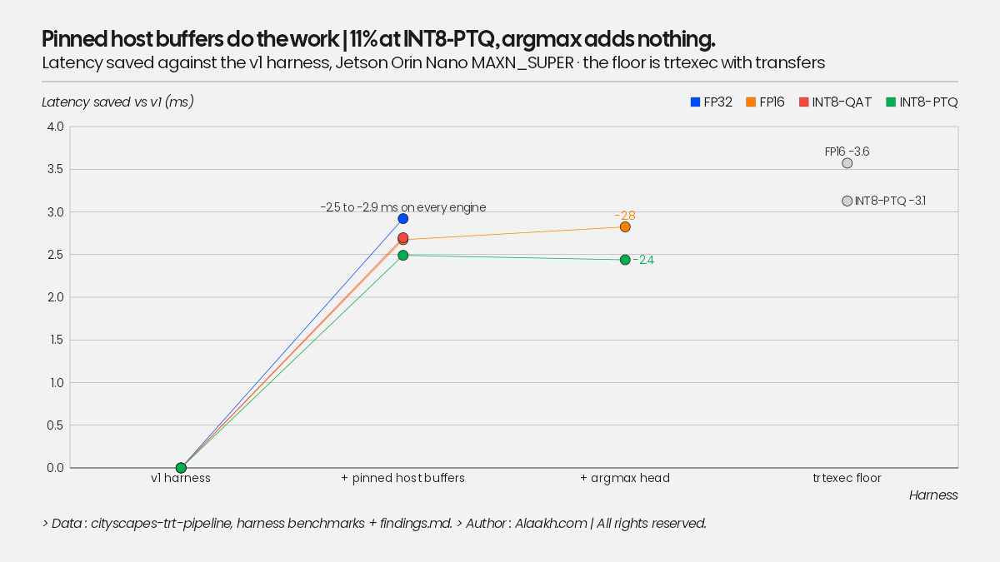

Pinned host buffers: -2.5 ms on every engine (11% at INT8), landing within
0.6 ms of trtexec. Pageable numpy arrays force the driver to stage every copy
through an internal pinned buffer; allocating the host side as pinned torch
tensors and copying on a private stream makes H2D/D2H true async DMA. That is
the whole win, and INT8-QAT crosses 30 fps because of it.

On-device argmax: a wash at batch 1. The D2H copy drops from 0.94 to 0.08
ms as predicted (int32 mask instead of FP32 logits, 8x smaller), but the
ArgMax layer costs ~0.7 ms of GPU time; it's a full-resolution reduction over
8 channels, memory-bound like everything else here. Net zero. I'm keeping the
export because a real consumer wants the mask, not the logits, and on a
discrete GPU the same 16.8 MB crosses PCIe instead of unified memory; but it
is not a latency optimization on this board, and I'd rather record that than
pretend.

A trap on the way, worth more than the optimization: my first argmax export
wrapped the torch module, which prefixed every ONNX tensor name with
`/model/`. The INT8 calibration cache is keyed by tensor name, so nothing
matched, TensorRT had no scales, and with the FP16 fallback flag set it built
an all-FP16 engine without a word: 88 MB, FP16 speed, FP16 accuracy, labelled
int8. Two fixes: the argmax is now appended to the existing ONNX graph
(names preserved, asserted by a test), and `build_engine.py` builds with
`ProfilingVerbosity.DETAILED` and persists a per-precision layer histogram
from the engine inspector, warning when an `--int8` build has no INT8 layers.

That histogram also put a number on the QAT problem:

| engine | Int8 | Half | Float |
|---|---|---|---|
| FP16 | 0 | 85 | 1 |
| INT8-PTQ | 77 | 0 | 1 |
| INT8-QAT | 84 | **48** | 5 |

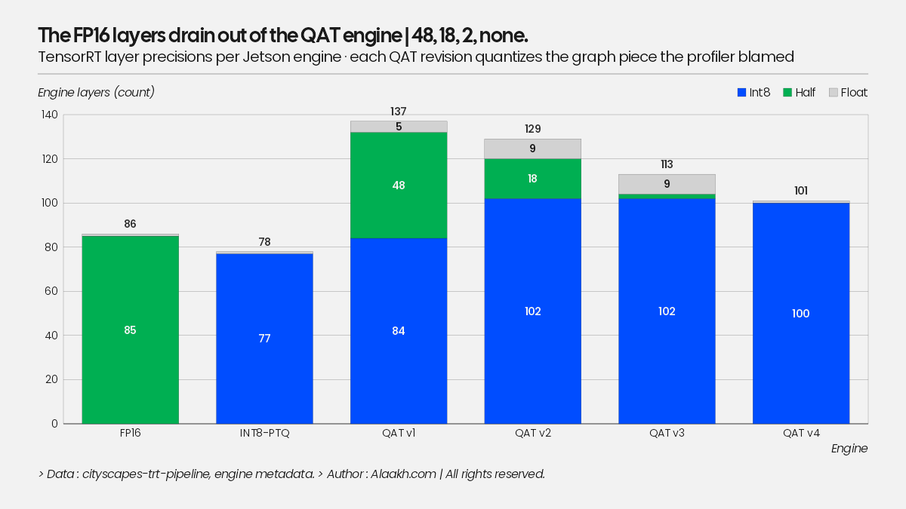

48 layers of the QAT engine run in FP16: the unquantized residual paths and
the re-quantization around them. That is the target for QAT v2.

## QAT v2: quantizing the residual branch

The fix for ADR-016: every ResNet bottleneck gets a quantizer on its identity
path so both inputs of the residual add carry Q/DQ and TensorRT can fuse
conv3 + add + ReLU into one INT8 kernel.

It took two runs, because ModelOpt has a second silent skip I hadn't met yet.
**If the model already contains any `TensorQuantizer`, both `mtq.quantize`
and `mto.restore` treat it as quantized and insert nothing.** My first v2 run
added the residual quantizers before `mtq.quantize`: it trained a model with
16 quantizers and zero on the convs, an FP32 fine-tune that reported 0.8331
mIoU and exported an ONNX with 16 Q/DQ pairs instead of 145. The engine
histogram (`Half: 85, Int8: 0`) caught it, and the checkpoint's state dict
confirmed it (0 conv amax entries). Order now: quantize, *then* add the
residual quantizers with an explicit histogram config, assert the quantizer
count, and export the trained model directly instead of restoring into a
fresh one. Two guards that didn't exist yesterday made a plausible wrong
result impossible to ship.

The real run:

| | pre-QAT calib | QAT best | engine mIoU | engine layers (5090) | 5090 ms |
|---|---|---|---|---|---|
| QAT v1 | 0.8186 | 0.8289 | 0.8290 | Int8 107 / Half 32 / Float 6 | 2.54 |
| QAT v2 | 0.8175 | 0.8288 | 0.8287 | Int8 107 / **Half 19** / Float 11 | 2.50 |

Accuracy unchanged (the residual quantizers cost nothing after fine-tuning),
13 fewer FP16 layers on the desktop build, no desktop latency change, which
is the expected non-result there. The remaining FP16 layers are the decoder
concat/resize paths, which I left unquantized on purpose: the profile said
the encoder was the problem. The Jetson build is the real test (v1 had 48
FP16 layers there and 31.8 ms vs PTQ's 20.4).

Also on this run: `pip install tensorrt` now resolves to the CUDA 13 build by
default, which fails at `createInferBuilder` with CUDA error 35 on a CUDA 12.8
image (driver 570). `tensorrt-cu12==10.*` is the pin that matches the torch
image; one more version trap for the list.

On the Jetson: 29.6 ms / 33.8 fps at 0.8287 (v1: 31.6 ms). The
histogram moved exactly as designed (FP16 layers 48 -> 18, INT8 84 -> 102)
and the latency moved 2 ms. Still 129 layers against PTQ's 78, and trtexec
compute-only says 27.8 vs 18.5 ms. The per-layer profile shows why: in the
PTQ engine each bottleneck's `conv3 + BN + add + ReLU` is one INT8 kernel; in
v2 `conv3` runs alone and the BN scale/shift + add + ReLU run as a separate
FP16 pointwise kernel (~0.7 ms each, the `PWN(ElementWise...)` entries). The
QAT ONNX still carries 63 `BatchNormalization` nodes: ModelOpt's `QuantConv2d`
isn't a plain conv, so the exporter can't fold BN into it, and a BN between
the conv and the add breaks TensorRT's explicit-quantization fusion pattern.
Implicit PTQ never had the problem because TensorRT folds BN itself before
picking precisions.

So the residual quantizer was necessary but not sufficient. The missing step
is the one NVIDIA's own QAT examples do first: fold BatchNorm into the conv
weights before quantization (exact in eval mode), so the graph is
`conv -> add -> ReLU` with Q/DQ where TensorRT expects it. That is QAT v3.

### QAT v3: fold BatchNorm first

`segdeploy.model.fold_batchnorm` folds all 63 BN layers into their convs on
the plain model (exact; tested to 1e-4), then the v2 recipe runs on a
BN-free graph. The exported ONNX has zero `BatchNormalization` nodes.

| Jetson | layers | Int8 / Half / Float | trtexec compute | harness | mIoU |
|---|---|---|---|---|---|
| INT8-PTQ | 78 | 77 / 0 / 1 | 18.7 ms | 20.4 | 0.8236 |
| QAT v1 | 137 | 84 / 48 / 5 | 29.9 | 31.6 | 0.8290 |
| QAT v2 | 129 | 102 / 18 / 9 | 27.9 | 29.6 | 0.8287 |
| QAT v3 | 113 | 102 / **2** / 9 | 24.6 | **26.4** | 0.8268 |

The fusion now happens: `layer1.1/conv3 + Add + relu` is one INT8 kernel at
0.274 ms, identical to PTQ's 0.273. FP16 layers are down to two. And yet 35
layers and 6 ms remain, all in one place: the last block of every encoder
stage. Its output feeds the next stage *and* a decoder skip connection, and
the decoder's `concat` inputs were never quantized, so TensorRT has to emit
that block's output in FP16: the fused kernel runs 3x slower (0.83 ms), plus
a standalone DequantizeLinear (0.48 ms) and a reformat. Four stage boundaries
x ~1.3 ms. Implicit PTQ quantizes the concat inputs on its own. That is v4:
quantizers on the two concat inputs of each decoder block.

Training note: with BN folded, the fine-tune **diverged after epoch 1** (0.8267
-> 0.581 -> 0.496 at lr 1e-5). Folding removes the normalization that kept the
v1/v2 fine-tunes stable; the best-epoch checkpoint logic saved the run, at
0.2 pts below v2. v4 gets a lower learning rate.

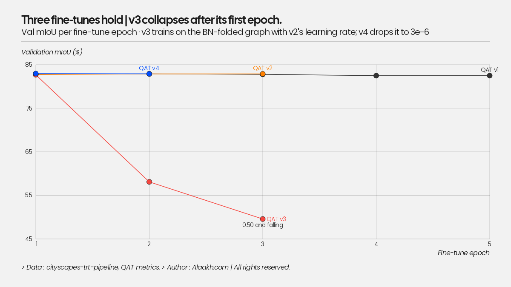

### QAT v4: quantize the concat inputs. Done.

Quantizers on both inputs of every decoder concat (placed *before* the
upsample so the encoder stage output has only quantized consumers; dec0's
unused skip quantizer is disabled at calibration). Fine-tune at lr 3e-6,
which keeps the BN-folded model stable (0.8295 epoch 1, 0.8289 epoch 2).

| Jetson, MAXN_SUPER | layers | Int8 / Half / Float | trtexec compute | harness | fps | W | mJ/frame | mIoU |
|---|---|---|---|---|---|---|---|---|
| FP16 | 85 | 0 / 85 / 1 | 37.2 | 38.9 | 25.7 | 20.4 | 848 | 0.8334 |
| INT8-PTQ | 78 | 77 / 0 / 1 | 18.7 | 20.4 | 49.0 | 16.4 | 377 | 0.8236 |
| QAT v1 | 137 | 84 / 48 / 5 | 29.9 | 31.6 | 31.6 | 18.2 | 576 | 0.8290 |
| QAT v2 (+residual Q/DQ) | 129 | 102 / 18 / 9 | 27.9 | 29.6 | 33.8 | 19.3 | 572 | 0.8287 |
| QAT v3 (+BN folded) | 113 | 102 / 2 / 9 | 24.6 | 26.4 | 37.9 | 18.0 | 475 | 0.8268 |
| **QAT v4 (+concat Q/DQ)** | **101** | **100 / 0 / 1** | **18.2** | **19.9** | **50.2** | **18.3** | **365** | **0.8296** |

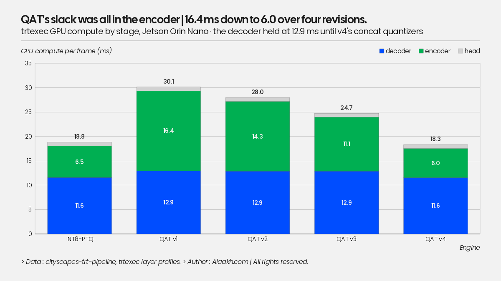

Stage by stage, the four revisions were an encoder story: 16.4 ms of encoder
compute at v1, 6.0 at v4, while the decoder held at 12.9 ms until the concat
quantizers landed.

v4 is faster than PTQ (18.2 vs 18.7 ms compute) and 0.6 mIoU points more
accurate, at the same 45 MB. Against FP16: 1.9x faster, 2.3x less
energy per frame, for 0.4 mIoU points. That is the best point on the whole
chart, and it took four engines to get there, each one fixing a specific
layer the profiler had named. Per-class at v4:
object 0.607, human 0.769 (FP32: 0.616, 0.774). The thin classes lost
~1 point and nothing else moved.

Where the remaining errors go, INT8 minus FP32 per true class: PTQ pushes
2.1% of nature's pixels into construction and 1.3% of object's; QAT v4 moves
nothing past 0.4 points.

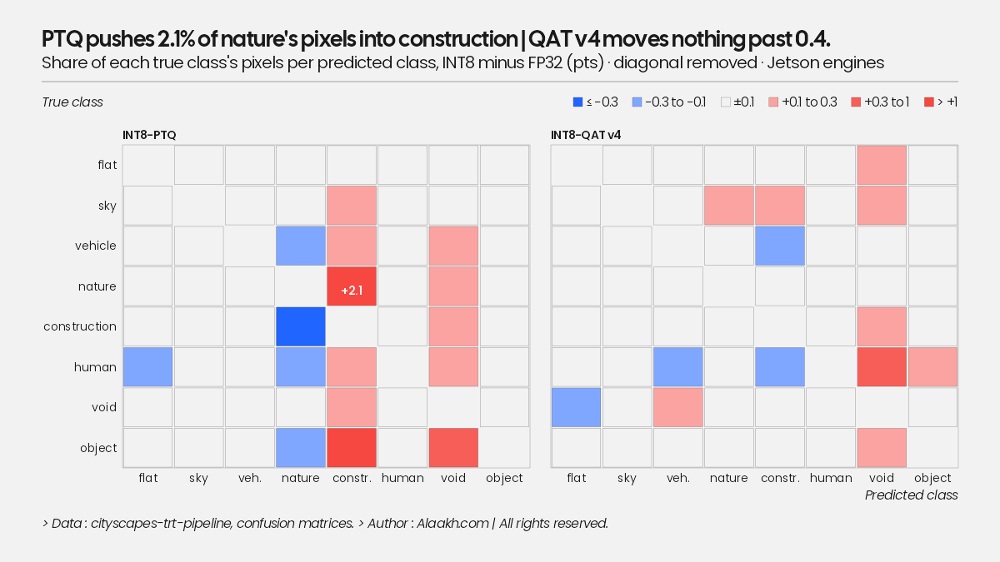

Why v4 beats PTQ rather than matching it: with every tensor explicitly
quantized, TensorRT has no precision decisions left to make and no reformats
to insert; PTQ's engine still carries a few FP32 boundary layers. On the
5090 the same fully-INT8 graph is *slower* than v3 (3.10 vs 2.47 ms): INT8
resize and requantized concat kernels cost more than they save when
bandwidth is free. The desktop and the Jetson disagree about INT8 one last
time, and the Jetson is the one that ships.

All desktop rows were re-measured with the v2 harness in the same session:
pinned buffers save ~0.5 ms (16%!) on the 5090 too, putting eager PyTorch to
TRT FP16 at 3.8x, and the table finally has one methodology top to bottom.

## Decoder width: a hardware-aware sweep, latency first

The profile said the decoder was 2/3 of the time. Latency depends on the
architecture, not the weights, so I exported six *untrained* variants and
measured them on the Jetson before training any of them (probe engines land
within ~5% of the trained baseline's numbers, so the method holds). Two knobs:
a width multiplier on the decoder channels, and dropping the full-resolution
block to predict at 1/2 res with a bilinear x2 on the logits.

| variant | FP16 ms | INT8 ms | encoder INT8 | decoder INT8 | params |
|---|---|---|---|---|---|
| width 1.0, full-res (baseline) | 40.8 | 21.2 | 6.9 | 11.7 | 43.9M |
| width 0.5, full-res | 26.0 | 16.2 | 7.0 | 6.8 | 32.5M |
| width 0.25, full-res | 21.5 | 13.7 | 7.0 | 4.3 | 27.7M |
| width 1.0, half-res | 34.7 | 18.3 | 7.2 | 8.5 | 43.9M |
| width 0.5, half-res | 23.4 | 13.7 | 7.0 | 4.2 | 32.5M |
| width 0.25, half-res | 19.7 | **12.1** | 7.0 | 2.7 | 27.7M |

- The ResNet50 encoder is a fixed floor: 7.0 ms INT8 in every variant. Below
  ~12 ms the decoder is already smaller than the backbone and the next thing
  to shrink is the backbone itself.
- Width beats resolution: halving the width saves 4.9 ms INT8, dropping the
  full-res block 2.9 ms. Both at 0.25: 43% faster than the baseline.
- Parameter count predicts none of this. The half-res variants have exactly
  the parameters of their full-res twins and are 14-19% faster; 0.5x width
  keeps 74% of the parameters and loses 24-36% of the latency.

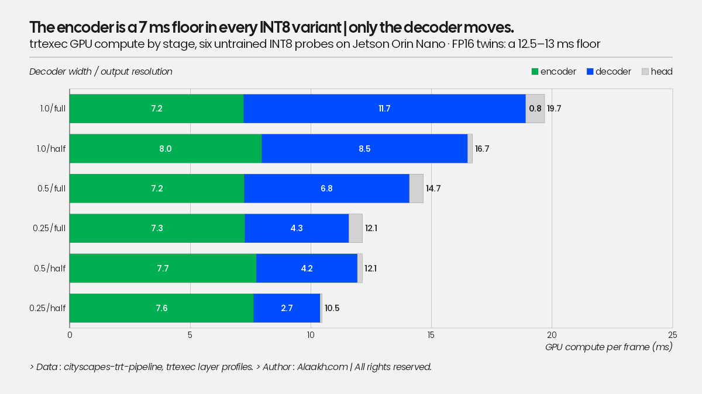

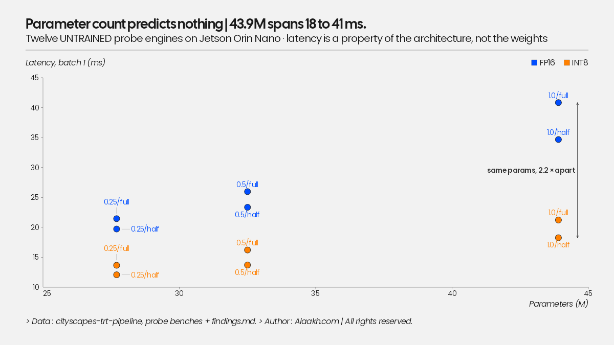

Accuracy is the other axis; three variants got the full 60-epoch training
(~$1.1 each), then FP16 and INT8-PTQ engines on the Jetson, per-variant
calibration on train images:

| variant | FP16 ms / mIoU | INT8 ms / mIoU | INT8 fps | INT8 mJ/frame |
|---|---|---|---|---|
| 1.0/full (baseline) | 38.9 / 0.8334 | 20.4 / 0.8236 (QAT v4 19.9 / 0.8296) | 50 | 365-389 |
| 0.5/full | 25.5 / 0.8312 | 15.7 / 0.8240 | 64 | 292 |
| 0.25/full | 21.0 / 0.8256 | 12.9 / 0.8125 | 78 | 215 |
| 0.25/half | 19.4 / 0.8279 | **11.3 / 0.8236** | **88** | **189** |

What the curve says:

- **Half the decoder width costs 0.2 mIoU points.** 0.5/full FP16 is 0.8312
  vs the baseline's 0.8334, at 65% of the latency. The baseline decoder is
  simply oversized for this task.
- **0.25/half strictly dominates 0.25/full.** Faster *and* more accurate in
  both precisions (INT8: 11.3 ms / 0.8236 vs 12.9 / 0.8125). At extreme
  narrowness, spending the remaining channels at half resolution plus a
  bilinear x2 on the logits beats a starved full-resolution block. I would
  not have guessed that; the measurement did.
- The headline: 0.25/half INT8 matches the baseline's INT8-PTQ accuracy
  (0.8236 exactly) at 1.8x the speed and 2.0x less energy. 11.3 ms,
  88 fps, 189 mJ/frame, 29 MB engine, on a $400 board at 17 W.
- The INT8 Pareto frontier is 0.25/half -> 0.5/full -> QAT-v4 baseline ->
  FP16 baseline. Everything else is dominated.
- Obvious next step if this were a product: the QAT v4 recipe on 0.25/half
  (would recover most of its PTQ loss at ~11 ms), and then the backbone,
  which is now the floor (7 ms of the 11.3).

The same points on the energy axis, and what the narrow decoders cost per class:

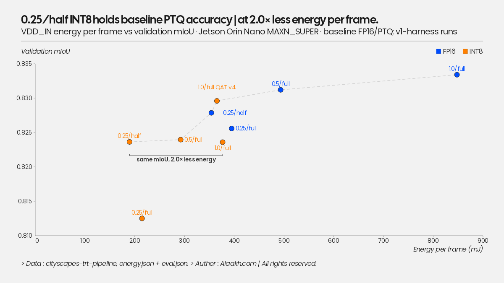

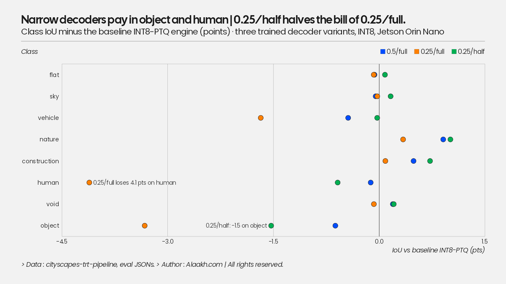

0.25/full pays 4.1 points on human and 3.3 on object against the baseline
INT8-PTQ engine; 0.25/half cuts that to 0.6 and 1.5 and gains on nature and
construction. Training tells the same story from the other end: the narrow
decoders start far behind (0.25/full at 0.18 mIoU after epoch 1) and finish
0.2 to 0.7 points under the baseline.

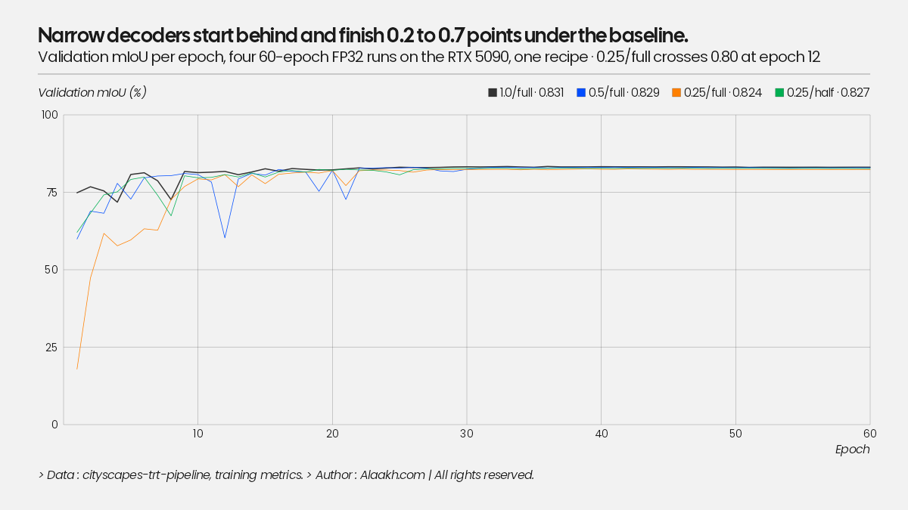

## Toolchain notes (the parts nobody's blog post mentions)

- **TensorRT 11 removed `IInt8EntropyCalibrator2`.** Implicit INT8
  quantization is gone there; explicit Q/DQ is the only INT8 path. I pinned
  desktop TRT to 10.x to match what JetPack ships on the Orin, which also
  keeps the entropy-calibration PTQ row reproducible. Practical consequence:
  calibrator-style PTQ is legacy API on borrowed time; the QAT/Q-DQ pipeline
  is the one with a future.
- **pycuda is a liability as a dependency.** No wheels, needs nvcc + boost
  headers at install time, and the RunPod PyTorch image ships neither. Torch
  is a hard dependency of this project anyway, so the TRT runner and the
  calibrator now use torch CUDA tensors as device buffers (`data_ptr()` +
  current stream). One less install step on every target, Jetson included.
- **`IHostMemory` lost `len()` somewhere before TRT 10.16.** Use
  `memoryview(x).nbytes`. Small, but it broke the engine-metadata sidecar.
- Engine builds look slow (~minutes) only on the first build per machine;
  TensorRT's kernel-timing cache makes every subsequent build take seconds.
  Consequence: rebuilding all engines from ONNX on a fresh pod costs almost
  nothing, so engines really can be treated as disposable.

## Next

- QAT v4 recipe on 0.25/half; then the backbone is the remaining lever.
- Re-measure the desktop rows with the v2 harness so both columns of the
  table share one methodology.
- Thinner decoder as the architecture experiment the profile points at.
